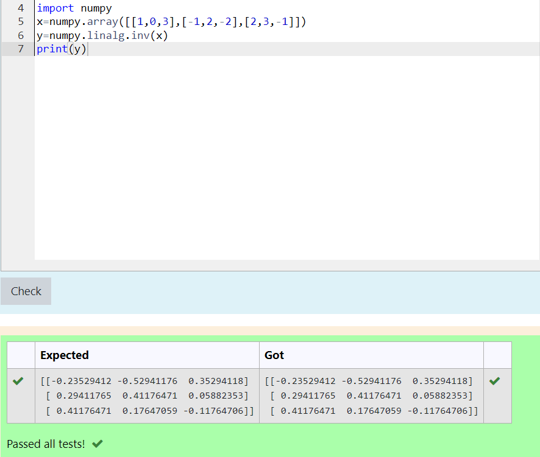

# INVERSE-OF-A-MATRIX
## Aim:
To write a python program to find the inverse of a matrix
## Equipment’s required:
1. 	Hardware – PCs
2. 	Anaconda – Python 3.7 Installation / Moodle-Code Runner
## Algorithm:
### Step1 : 
Comence the program
### Step 2: 
Import numpy file and enter the matrix elements
### Step 3: 
Using the np.linalg.inv(), we can find the inverse of the given matrix.
### Step 4: 
Print the inverse and conclude the program 

## Program:
~~~
import numpy
x=numpy.array([[1,0,3],[-1,2,-2],[2,3,-1]])
y=numpy.linalg.inv(x)
print(y)
~~~
## Output:

## Result:
Thus the inverse of given matrix is successfully solved using python program

